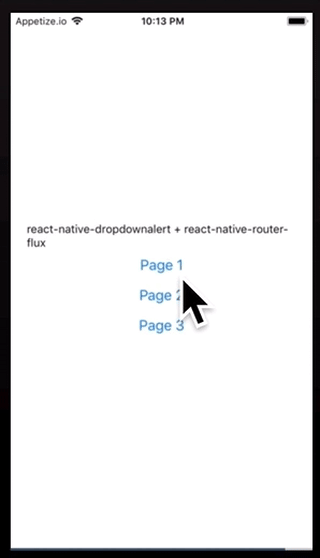

# react-native-dropdownalert-router-sample

Simple demo project for react-native-dropdownalert and react-native-router-flux working together!

## Installing / Getting started
Clone this repo, and then run the following commands.

```
npm install
npm start
```

## Snack Expo(demo)

- https://snack.expo.io/@git/github.com/mitsuruog/react-native-dropdownalert-router-sample



## License

MIT
